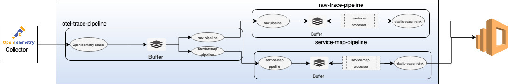
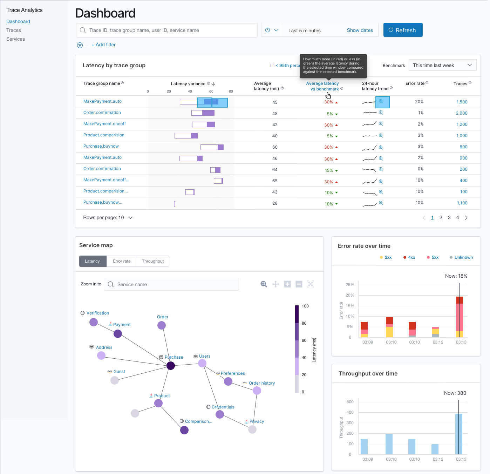
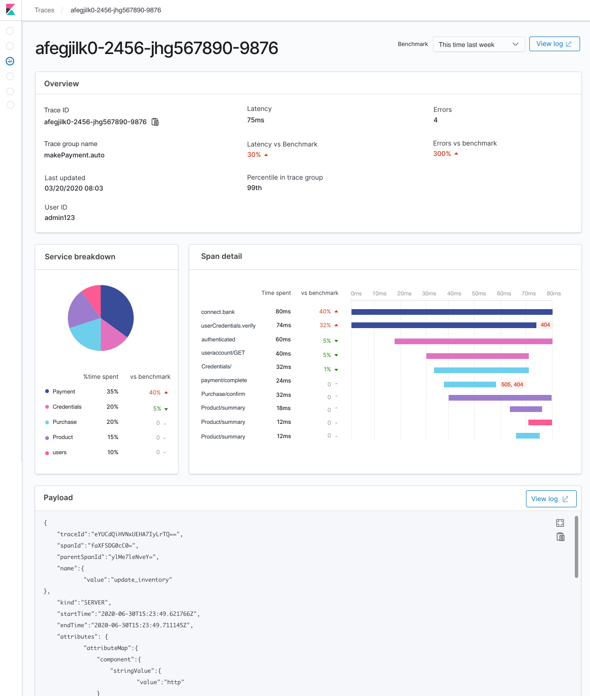
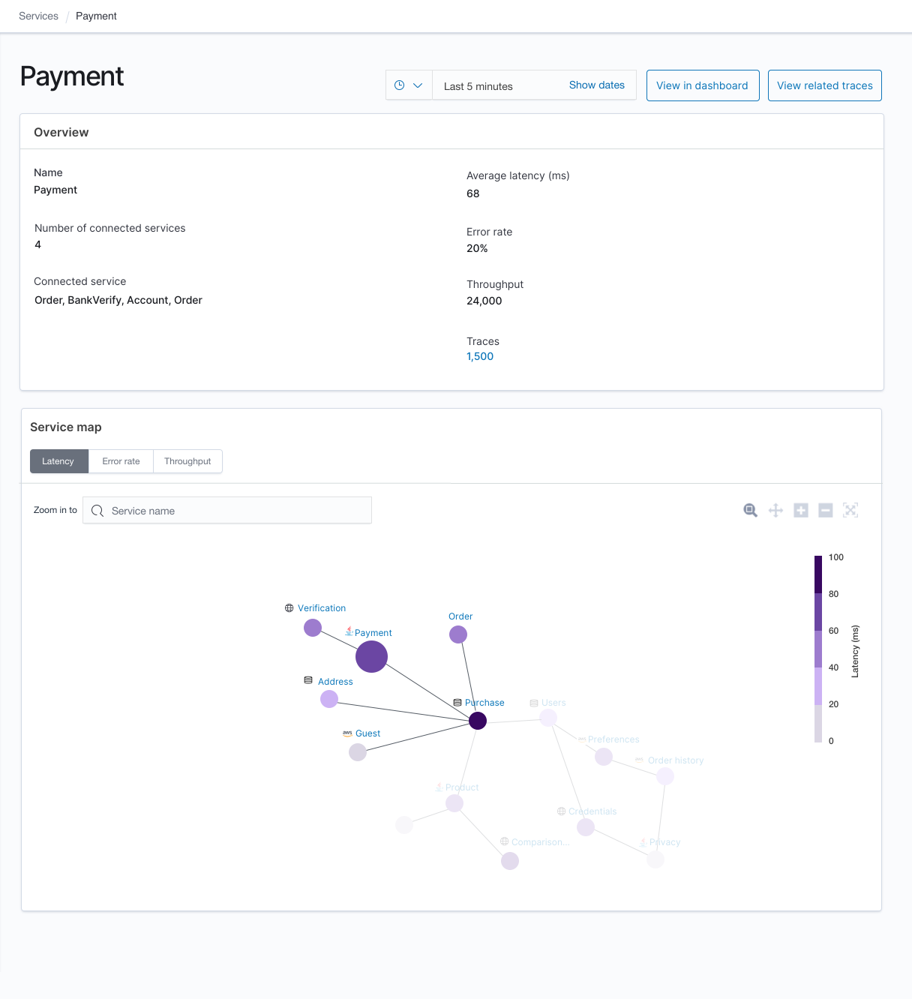

# RFC - Trace Analytics
## 1. Overview
OpenSearch users already store their log data which allows them to access log events in their services. However, with the log data alone, the user can not pinpoint where the error occurred or what caused the poor performance. This means they need another datastore or going into a different codebase to determine the context of the log event. The overall result is that the user has to rely on multiple products, software, log data, and human ingenuity to track down problems with their systems. The goal is to reduce the number of contexts switches a 
user must do in order to solve a problem in production, we will achieve this through a set of Application Performance Management (APM) features. 
As the first step, in 2020 we will offer Trace Analytics, which will allow users to store trace information and provide them a holistic view of their
 service under observation.

## 2. Approach
The Trace Analytics feature will embrace the Open Telemetry standard and provide the required plugins and adapters to integrate with the ecosystem. 
Adoption to the OpenTelemetry ecosystem will benefit users of existing tracing standards like Zipkin and OpenTracing to use the Trace Analytics feature.
To support the trace analytics feature we will build a new service called Data Prepper, which receives trace data from the OpenTelemetry collector, process them to OpenSearch friendly docs, and stores them in users' OpenSearch cluster. The trace analytics will also provide an OpenSearch Dashboards plugin that will provide user-friendly dashboards on the stored trace data. 

## 3. Data Prepper

Data Prepper is an ingestion service which provides users to ingest and transform data before stored in OpenSearch. 

### 3.1 General Data Prepper design

#### 3.1.1 Concepts 

Below are the fundamental concepts of Data Prepper,

*Pipeline:*
A Data Prepper pipeline has four key components source, buffer, processor, and sink. A single instance of Data Prepper can have one or more pipelines. A pipeline definition contains two required components source and sink. By default, the Data Prepper pipeline will use the default buffer and no processor. All the components are pluggable and enable a user to plugin their custom implementations. Please note that custom implementations will have implications on guarantees however the basic interfaces will remain the same.

*Source:*
The source is the input component of a pipeline, it defines the mechanism through which a Data Prepper pipeline will consume records. The source component could consume records either by receiving over http/s or reading from external endpoints like Kafka, SQS, Cloudwatch, etc.  The source will have its own configuration options based on the type like the format of the records (string/JSON/cloudwatch logs/open telemetry trace), security, concurrency threads, etc. The source component will consume records and write them to the buffer component. 

*Buffer:*
The buffer component will act as the layer between the source and sink. The buffer could either be in-memory or disk-based. The default buffer will be in-memory queue bounded by the number of records/size of records.

*Sink:*
Sink in the output component of the pipeline, it defines the one or more destinations to which a Data Prepper pipeline will publish the records. A sink destination could be either service like OpenSearch, Amazon OpenSearch Service, or S3. The sink will have its own configuration options based on the destination type like security, request batching, etc. A sink can be another Data Prepper pipeline, this would provide users the benefit chain multiple Data Prepper pipelines.

*Processor:*
Processor component of the pipeline, these are intermediary processing units using which users can filter, transform, and enrich the records into the desired format before publishing to the sink. The processor is an optional component of the pipeline, if not defined the records will be published in the format as defined in the source. You can have more than one processor and they are executed in the order they are defined in the pipeline spec.

Data Prepper will be an OpenSearch community-driven project, the end goal is to make multiple Source, Sink, and Processor plugins available.

#### 3.1.2 Trace Analytics

In the first release of Data Prepper, we will support only one Data Prepper pipeline for the Trace Analytics feature. Below is design of the Trace Analytics feature pipeline .

 
 

##### OpenTelemetry Trace Source

The OpenTelemetry source will be accepting trace data from the OpenTelemetry collector. The source will depend on [OpenTelemetry Protocol](https://github.com/open-telemetry/opentelemetry-specification/tree/master/specification/protocol). This would
mean we will support transport over gRPC, HTTP/Proto and HTTP/JSON. The source will support industry-standard encryption (TLS/HTTPS). 

##### Processors

We are building two processors for the Trace Analytics feature,
* *otel-trace-raw-prepper* -  This processor will be responsible for converting the trace data in [OpenTelemetry specification](https://github.com/open-telemetry/opentelemetry-proto/tree/master/opentelemetry/proto/trace/v1) to OpenSearch friendly (JSON) docs. These OpenSearch friendly docs will have minimal additional fields like duration which are not part of the original specification. These additional fields are to make the instant OpenSearch Dashboards dashboards user-friendly.
* *service-map-prepper* -  This processor will perform the required preprocessing on the trace data and build metadata to display the service-map OpenSearch Dashboards dashboards.

##### OpenSearch sink

We will build a generic sink that will write the data to OpenSearch as the destination. The OpenSearch sink will have configuration options related to OpenSearch cluster like endpoint, SSL/Username, index name, index template, index state management, etc. 
For the trace analytics feature, the sink will have specific configurations which will make the sink to use indices and index templates specific to the feature. Trace analytics specific OpenSearch indices are,
                                                                                                                                                                 
* *apm-trace-raw-v1* -  This index will store the output from otel-trace-raw-prepper. 
* *apm-service-map-v1* - This index will store the output from the service-map-prepper.

## 4. OpenSearch Dashboards

These two indices mentioned above will be used by the OpenSearch Dashboards plugin to provide the following instant dashboards,

NOTE: The above OpenSearch Dashboards dashboards are mockup UIs, they are subject to changes.

## Providing Feedback
If you have comments or feedback on our plans for Trace Analytics, please comment on this [github issue](https://github.com/opensearch-project/simple-ingest-transformation-utility-pipeline/issues/39)