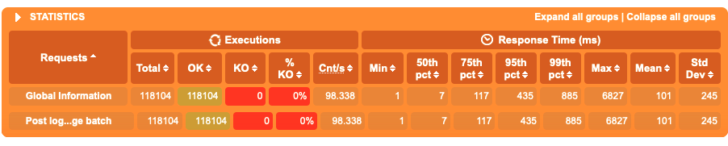
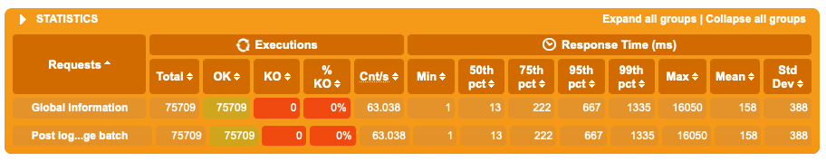
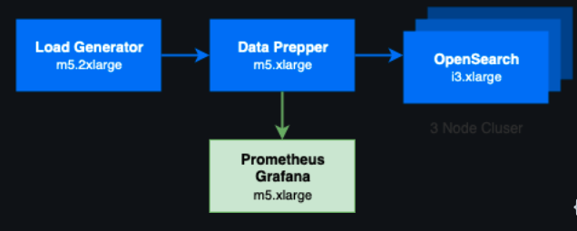
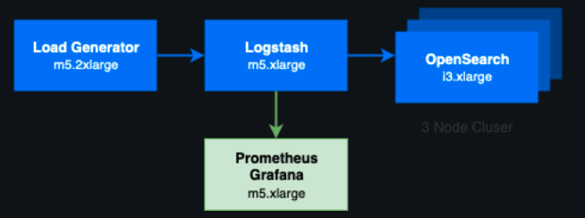

# Latest Performance Test Results

This page tracks our latest performance test runs from Data Prepper. We run tests with significant processors, as well as the equivalent Logstash filters. In the performance test results discussed below, the test environments and configurations are identical, except where the same option is not available for all applications.

## Results

Gatling reported the following results for the test that was run for Data Prepper. These results show that `118,104` requests were succesfully sent to Data Prepper. Throughput can be measured as
`118,104 * 200 (batch size) logs = 23,620,800 logs / 1,200 s = 19,684 logs/s`. The Gatling report also shows a distribution of latency on the side of the `http` source, with an average latency of `101 ms`




### Logstash

Gatling reported the following results for the test that was run for Data Prepper. These results show that `75,709` requests were succesfully sent to Data Prepper. Throughput can be measured as
`75,709 * 200 (batch size) logs = 15,141,800 logs / 1,200 s = 12,618 logs/s`. The Gatling report also shows a distribution of latency on the side of the `http` source, with an average latency of `158 ms`



### Conclusion
Data Prepper has a `56%` higher throughput than Logstash, and an average latency that is `56%` lower than Logstash.

## Environment Details

### Data Prepper Environment



### Logstash Environment



Comparing the performance of the latest release of Data Prepper 1.3 against Logstash 7.13.2, the test was configured to simulate 10 clients to send requests as frequently as possible. Each request was contained a batch of 200 logs. The test ran for 20 minutes, measuring the latency and throughput.

### AWS Resource Details

| Name                              | EC2 Instance Type | Instance Count | vCPU | Memory (GiB) | JVM Memory Limit (GiB) | Software Version |
|-----------------------------------| :---------------- | -------------: |-----:| -----------: |-----------------------:|-----------------:|
| Data Prepper                      | m5.xlarge         |              1 |    4 |           16 |                      8 |              1.3 |
| Data Prepper Prometheus + Grafana | m5.xlarge         |              1 |    4 |           16 |                        |              N/A |
| Data Prepper OpenSearch Cluster   | i3.xlarge         |              3 |    4 |         30.5 |                        |              N/A |
| Logstash                          | m5.xlarge         |              1 |    4 |           16 |                      8 |           7.13.2 |
| Logstash Prometheus + Grafana     | m5.xlarge         |              1 |    4 |           16 |                        |              N/A |
| Logstash OpenSearch Cluster       | i3.xlarge         |              3 |    4 |         30.5 |                        |              N/A |
| Gatling                           | m5.2xlarge        |              1 |    8 |           32 |                        |              N/A |

## Configurations

The following log was sent to the `http` source of Data Prepper and Logstash in batches of 200. 

```json
{
"log": "127.0.0.1 - frank [11/Dec/2021:10:00:00 -0700] \"GET /apache_pb.gif?paramKey1=paramValue1&paramKey2=paramValue2&paramKey3=paramValue3 HTTP/1.0\" 200 2326"
}
```

Ingesting this log through Data Prepper results in the following document being sent to OpenSearch.

```json
{
  "_index": "data_prepper",
  "_type": "_doc",
  "_id": "BEz2BYABkvwoydO0vqsG",
  "_version": 1,
  "_score": null,
  "_source": {
    "log": "127-0-0-1 - FRANK [11/DEC/2021:10:00:00 -0700] \"GET /APACHE_PB-GIF?PARAMKEY1=PARAMVALUE1&PARAMKEY2=PARAMVALUE2&PARAMKEY3=PARAMVALUE3 HTTP/1-0\" 200 2326",
    "request": [
      "/apache_pb.gif",
      "paramKey1=paramValue1&paramKey2=paramValue2&paramKey3=paramValue3"
    ],
    "auth": "frank",
    "ident": "-",
    "response": "200",
    "bytes": "2326",
    "clientip": "127.0.0.1",
    "verb": "get",
    "httpversion": "1.0",
    "timestamp": "11/Dec/2021:10:00:00 -0700",
    "@timestamp": "2022-04-07T21:36:44.710Z",
    "query_params": {
      "paramKey2": "paramValue2",
      "paramKey3": "paramValue3",
      "paramKey1": "paramValue1"
    },
    "copy_key": "127-0-0-1 - FRANK [11/DEC/2021:10:00:00 -0700] \"GET /APACHE_PB-GIF?PARAMKEY1=PARAMVALUE1&PARAMKEY2=PARAMVALUE2&PARAMKEY3=PARAMVALUE3 HTTP/1-0\" 200 2326"
  }
}
```

The configuration files include the following sources, processors, and sinks.

### Sources
* http

### Processors
* grok
* date
* substitute_string
* uppercase_string
* lowercase_string
* trim_string
* split_string
* key_value
* add_entries
* rename_keys
* copy_values
* delete_entries

### Sinks
* opensearch

### 

### Data Prepper pipeline configuration

```yaml
log-pipeline:
  workers: 12
  delay: 50
  source:
    http:
      ssl: false
      port: 2021
      thread_count: 4
      max_connection_count: 2000
      request_timeout: 10000
  buffer:
    bounded_blocking:
      buffer_size: 2000000
      batch_size: 5000
  processor:
    - grok:
        match:
          log: [ "%{COMMONAPACHELOG}" ]
    - date:
        from_time_received: true
        destination: "@timestamp"
    - substitute_string:
        entries:
          - source: "log"
            from: '\.'
            to: "-"
    - uppercase_string:
        with_keys:
          - "log"
    - trim_string:
        with_keys:
          - "log"
    - split_string:
        entries:
          - source: "request"
            delimiter: "?"
    - key_value:
        source: "/request/1"
        field_split_characters: "&"
        value_split_characters: "="
        destination: "query_params"
    - lowercase_string:
        with_keys:
          - "verb"
    - add_entries:
        entries:
          - key: "entry1"
            value: "entry1value"
          - key: "entry2"
            value: "entry2value"
          - key: "entry3"
            value: "entry3value"
    - rename_keys:
        entries:
          - from_key: "entry1"
            to_key: "renameEntry1"
          - from_key: "entry2"
            to_key: "renameEntry2"
          - from_key: "entry3"
            to_key: "renameEntry3" 
    - copy_values:
        entries:
          - from_key: "log"
            to_key: "copy_key"
    - delete_entries:
        with_keys: ["renameEntry1", "renameEntry2", "renameEntry3"]

  sink:
    - opensearch:
        hosts: [ "myOpenSearchEndpoint" ]
        index: "data_prepper"
        username: "username"
        password: "password"
```

## Logstash Configuration

```
input {
    http {
        ssl => false
        port => 2021
        codec => "json"
	threads => 4
    }
}

filter {
    grok {
        match => {"log" => "%{COMMONAPACHELOG}"}
    }

    mutate {
        gsub => ["log", "\.", "-"]
    }

    mutate {
        uppercase => [ "log" ]
    }

    mutate {
        strip => [ "log" ]
    }

    mutate {
        split => { "request" => "?" }
    }

    kv {
        field_split => "&"
        value_split => "="
        source => "[request][1]"
        target => "query_params"
    }

    mutate {
        lowercase => [ "verb" ]
    }

    mutate {
        add_field => {
            "entry1" => "entry1value"
            "entry2" => "entry2value"
            "entry3" => "entry3value"
        }
    }

    mutate {
        rename => {
            "entry1" => "renameEntry1"
            "entry2" => "renameEntry2"
            "entry3" => "renameEntry3"
        }
    }

    mutate {
        copy => {
            "log" => "copy_key"
        }
    }

    mutate {
        remove_field => ["renameEntry1", "renameEntry2", "renameEntry3"]
    }
}

output {
    opensearch {
        hosts => ["myOpenSearchEndpoint"]
        user        => "user"
        password    => "password"
        ssl => true
        ssl_certificate_verification => false
        index       => "logstash"
    }
} 
```

The following changes were made to the `logstash.yml` file in order to replicate the Data Prepper configuration as much as possible

```yaml
pipeline.workers: 12
pipeline.batch.size: 5000
```

## Running tests

If you wish to run performance tests on your own Data Prepper configuration, you can replicate the environment used. You can utilize the Gatling performance test suite in this repo on another EC2, and point Gatling to your running Data Prepper instance with the following command:

```
./gradlew --rerun-tasks :performance-test:gatlingRun-org.opensearch.dataprepper.test.performance.FixedClientSimulation -Dhost="<target_url>" -DlogFile="/path/to/logFile"
```
After all tests have completed HTML reports will be created in `data-prepper/performance-test/build/reports/gatling/<simulation-name>-<unix-timestamp>/index.html`. Further instructions on running performance tests and Gatling are available in the repository readme.