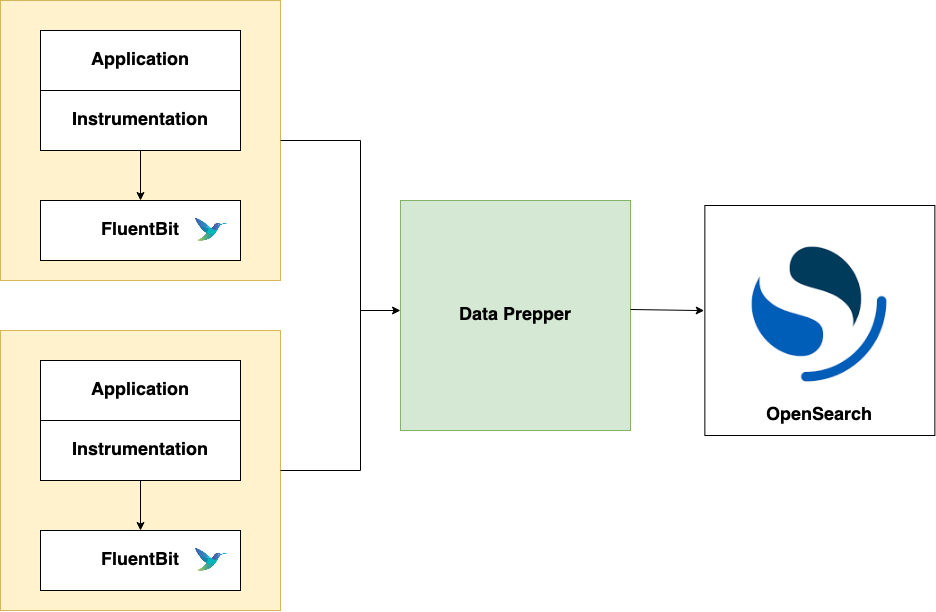

# Log Analytics

## Introduction

Data Prepper is an extendable, configurable, and scalable solution for log ingestion into OpenSearch and Amazon OpenSearch Service.
Currently, Data Prepper is focused on receiving logs from [FluentBit](https://fluentbit.io/) via the 
[Http Source](https://github.com/opensearch-project/data-prepper/blob/main/data-prepper-plugins/http-source/README.md), and processing those logs with a [Grok Processor](https://github.com/opensearch-project/data-prepper/blob/main/data-prepper-plugins/grok-processor/README.md) before ingesting them into OpenSearch through the [OpenSearch sink](https://github.com/opensearch-project/data-prepper/blob/main/data-prepper-plugins/opensearch/README.md).

Here is all of the components for log analytics with FluentBit, Data Prepper, and OpenSearch:
<br />
<br />

<br />
<br />

In your application environment you will have to run FluentBit.
FluentBit can be containerized through Kubernetes, Docker, or Amazon ECS.
It can also be run as an agent on EC2.
You should configure the [FluentBit http output plugin](https://docs.fluentbit.io/manual/pipeline/outputs/http) to export log data to Data Prepper.
You will then have to deploy Data Prepper as an intermediate component and configure it to send
the enriched log data to your OpenSearch cluster or Amazon OpenSearch Service domain. From there, you can
use OpenSearch Dashboards to perform more intensive visualization and analysis.

## Log Analytics Pipeline

Log analytic pipelines in Data Prepper are extremely customizable. A simple pipeline is shown below.


## Http Source

The [Http Source](https://github.com/opensearch-project/data-prepper/blob/main/data-prepper-plugins/http-source/README.md) accepts log data from FluentBit. 
More specifically, this source accepts log data in a JSON array format. 
This source supports industry-standard encryption in the form of TLS/HTTPS and HTTP basic authentication.

## Processor

The Data Prepper 1.2 release will come with a [Grok Processor](https://github.com/opensearch-project/data-prepper/blob/main/data-prepper-plugins/grok-processor/README.md).
The Grok Processor can be an invaluable tool to structure and extract important fields from your logs in order to make them more queryable.

The Grok Processor comes with a wide variety of [default patterns](https://github.com/thekrakken/java-grok/blob/master/src/main/resources/patterns/patterns) that match against common log formats like apcahe logs or syslogs, 
but can easily accept any custom patterns that cater to your specific log format.

There are a lot of complex Grok features that will not be discussed here, so please read the documentation if you are interested.

## OpenSearch sink

We have a generic sink that writes the data to OpenSearch as the destination. The [opensearch sink](https://github.com/opensearch-project/data-prepper/blob/main/data-prepper-plugins/opensearch/README.md) has configuration options related to an OpenSearch cluster like endpoint, SSL/Username, index name, index template, index state management, etc.

## Pipeline Configuration

Example `pipeline.yaml` with SSL and Basic Authentication enabled for the `http-source`:


```yaml
log-pipeline:
  source:
    http:
      ssl: true
      ssl_certificate_file: "/full/path/to/certfile.crt"
      ssl_key_file: "/full/path/to/keyfile.key"
      # The default port that will listen for incoming logs
      port: 2021
      authentication:
        http_basic:
          username: "myuser"
          password: "mys3cret"
  processor:
    - grok:
        match:
          # This will match logs with a "log" key against the COMMONAPACHELOG pattern (ex: { "log": "actual apache log..." } )
          # You should change this to match what your logs look like. See the grok documenation to get started.
          log: [ "%{COMMONAPACHELOG}" ]
  sink:
    - opensearch:
        hosts: [ "https://localhost:9200" ]
        # Change to your credentials
        username: "admin"
        password: "admin"
        # Add a certificate file if you are accessing an OpenSearch cluster with a self-signed certificate  
        #cert: /path/to/cert
        # If you are connecting to an Amazon OpenSearch Service domain without
        # Fine-Grained Access Control, enable these settings. Comment out the
        # username and password above.
        #aws_sigv4: true
        #aws_region: us-east-1
        # Since we are grok matching for apache logs, it makes sense to send them to an OpenSearch index named apache_logs.
        # You should change this to correspond with how your OpenSearch indices are set up.
        index: apache_logs
```
<br></br>
Example `pipeline.yaml` without SSL and Basic Authentication enabled for the `http-source`:

```yaml
log-pipeline:
  source:
    http:
      # Explicitly disable SSL
      ssl: false
      # Explicitly disable authentication
      authentication:
        unauthenticated:
      # The default port that will listen for incoming logs
      port: 2021
  processor:
    - grok:
        match:
          # This will match logs with a "log" key against the COMMONAPACHELOG pattern (ex: { "log": "actual apache log..." } )
          # You should change this to match what your logs look like. See the grok documenation to get started.
          log: [ "%{COMMONAPACHELOG}" ]
  sink:
    - opensearch:
        hosts: [ "https://localhost:9200" ]
        # Change to your credentials
        username: "admin"
        password: "<admin password>"
        # Add a certificate file if you are accessing an OpenSearch cluster with a self-signed certificate  
        #cert: /path/to/cert
        # If you are connecting to an Amazon OpenSearch Service domain without
        # Fine-Grained Access Control, enable these settings. Comment out the
        # username and password above.
        #aws_sigv4: true
        #aws_region: us-east-1
        # Since we are grok matching for apache logs, it makes sense to send them to an OpenSearch index named apache_logs.
        # You should change this to correspond with how your OpenSearch indices are set up.
        index: apache_logs
```

This pipeline configuration is an example of apache log ingestion. Don't forget that you can easily configure the Grok Processor for your own custom logs.

You will need to modify the configuration above for your OpenSearch cluster.

The main changes you will need to make are:

* `hosts` - Set to your hosts
* `index` - Change this to the OpenSearch index you want to send logs to
* `username`- Provide the OpenSearch username
* `password` - Provide your OpenSearch password
* `aws_sigv4` - If you use Amazon OpenSearch Service with AWS signing, set this to true. It will sign requests with the default AWS credentials provider.
* `aws_region` - If you use Amazon OpenSearch Service with AWS signing, set this value to your region.
## FluentBit

You will have to run FluentBit in your service environment. You can find the installation guide of FluentBit [here](https://docs.fluentbit.io/manual/installation/getting-started-with-fluent-bit).
Please ensure that you can configure the [FluentBit http output plugin](https://docs.fluentbit.io/manual/pipeline/outputs/http) to your Data Prepper Http Source. Below is an example `fluent-bit.conf` that tails a log file named `test.log` and forwards it to a locally running Data Prepper's http source, which runs 
by default on port 2021. Note that you should adjust the file `path`, output `Host` and `Port` according to how and where you have FluentBit and Data Prepper running.

Example `fluent-bit.conf` without SSL and Basic Authentication enabled on the http source:

```
[INPUT]
  name                  tail
  refresh_interval      5
  path                  test.log
  read_from_head        true

[OUTPUT]
  Name http
  Match *
  Host localhost
  Port 2021
  URI /log/ingest
  Format json
```

If your http source has SSL and Basic Authentication enabled, you will need to add the details 
of `http_User`, `http_Passwd`, `tls.crt_file`, and `tls.key_file` to the `fluent-bit.conf` as shown below.

Example `fluent-bit.conf` with SSL and Basic Authentication enabled on the http source:

```
[INPUT]
  name                  tail
  refresh_interval      5
  path                  test.log
  read_from_head        true

[OUTPUT]
  Name http
  Match *
  Host localhost
  http_User myuser
  http_Passwd mys3cret
  tls On
  tls.crt_file /full/path/to/certfile.crt
  tls.key_file /full/path/to/keyfile.key
  Port 2021
  URI /log/ingest
  Format json
```

## Next Steps

Follow the [Log Ingestion Demo Guide](../examples/log-ingestion/README.md) to go through a specific example of Apache log ingestion from `FluentBit -> Data Prepper -> OpenSearch` running through Docker.

In the future, Data Prepper will contain additional sources and processors which will make more complex log analytic pipelines available. Check out our [Roadmap](https://github.com/opensearch-project/data-prepper/projects/1) to see what is coming.  

If there is a specifc source, processor, or sink that you would like to include in your log analytic workflow, and it is not currently on the Roadmap, please bring it to our attention by making a Github issue. Additionally, if you
are interested in contributing, see our [Contribuing Guidelines](../CONTRIBUTING.md) as well as our [Developer Guide](developer_guide.md) and [Plugin Development Guide](plugin_development.md).
