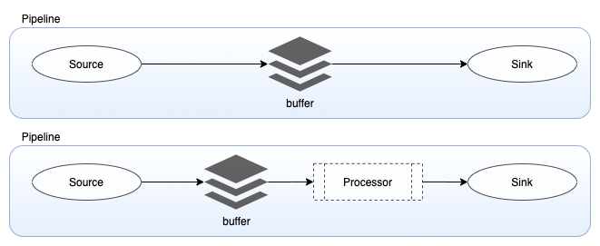

# Data Prepper

Data Prepper is an open source utility service. Data Prepper is a server side data collector with abilities to filter, enrich, transform, normalize and aggregate data for downstream analytics and visualization.
The broader vision for Data Prepper is to enable an end-to-end data analysis life cycle from gathering raw logs to facilitating sophisticated and actionable interactive ad-hoc analyses on the data. 

## Concepts



Below are the fundamental concepts of Data Prepper,

### Pipeline
A Data Prepper pipeline has four key components a *source*, a *buffer*, one or more *processors*, and one or more *sinks*. A single instance of Data Prepper can have one or more pipelines. A pipeline definition contains two required components *source* and *sink*. If other components are missing the Data Prepper pipeline will use default buffer and no-op processor. All the components are pluggable and enable customers to plugin their custom implementations. Please note that custom implementations will have implications on guarantees however the basic interfaces will remain same.

### Source
Source is the input component of a pipeline, it defines the mechanism through which a Data Prepper pipeline will consume records. A pipeline can have only one source. Source component could consume records either by receiving over http/s or reading from external endpoints like Kafka, SQS, Cloudwatch etc.  Source will have its own configuration options based on the type like the format of the records (string/json/cloudwatch logs/open telemetry trace) , security, concurrency threads etc . The source component will consume records and write them to the buffer component. 

### Buffer
The buffer component will act as the layer between the *source* and *sink.* The buffer could either be in-memory or disk based. The default buffer will be in-memory queue bounded by the number of records called `bounded_blocking`. If the buffer component is not explicitly mentioned in the pipeline configuration, the default `bounded_blocking` will be used.

### Sink
Sink is the output component of pipeline, it defines the one or more destinations to which a Data Prepper pipeline will publish the records. A sink destination could be either services like OpenSearch, S3 or another Data Prepper pipeline. By using another Data Prepper pipeline as sink, we could chain multiple Data Prepper pipelines. Sink will have its own configuration options based on the destination type like security, request batching etc. 

### Processor
Processor component of the pipeline, these are intermediary processing units using which users can filter, transform and enrich the records into desired format before publishing to the sink. The processor is an optional component of the pipeline, if not defined the records will be published in the format as defined in the source. You can have more than one processor, and they are executed in the order they are defined in the pipeline spec.

### Route
Data Prepper supports routes on events. These allow pipeline authors to send only events matching certain conditions to different sinks.

### Prepper
Preppers were renamed to Processors and are no longer supported starting in DataPrepper 2.0. Please see [Deprecated Pipeline Configuration Support](configuration.md#deprecated-pipeline-configuration-support) section in the Configuration document for more details.

### Sample Pipeline configuration

#### Minimal components
```
sample-pipeline:
  source:
    file:
        path: path/to/input-file
  sink:
    - file:
        path: path/to/output-file
```

This configuration reads from file source and writes to a file source. It uses default options for other options for other components.

#### All components

```
sample-pipeline:
  workers: 4 #Number of workers
  delay: 100 # in milliseconds, how often the workers should run
  source:
    file:
        path: path/to/input-file
  buffer:
    bounded_blocking:
      buffer_size: 1024 # max number of records the buffer will accept
      batch_size: 256 # max number of records the buffer will drain for each read
  processor:
    - string_converter:
       upper_case: true
  sink:
    - file:
       path: path/to/output-file
```

The above pipeline has a file source that reads string records from the `input-file`. The source pushes the data to buffer bounded by max size of `1024`. The pipeline configured to have `4` workers each of them reading maximum of `256` records from the buffer for every `100 milliseconds`. Each worker will execute the `string_converter` processor and write the output of the processor to the `output-file`


## Pipeline Connectors

Some use-cases requires to use one or more heterogeneous sinks/processors. This means the pipeline architecture is now dependent on heterogeneous components which are diverse and could impact the availability and performance of one another. To avoid this, Data Prepper offers Pipeline Connectors. Pipeline Connectors help to process data from single source in multiple pipelines which are made up of heterogeneous components. Pipeline connectors are simple components which act as sink and source.

### Sample configuration 

```
input-pipeline:
  source:
    file:
      path: path/to/input-file
  sink:
    - pipeline:
       name: "output-pipeline-1"
    - pipeline:
       name: "output-pipeline-2"
output-pipeline-1:
  source:
    pipeline:
      name: "input-pipeline"
  processor:
    - string_converter:
       upper_case: true
  sink:
    - file:
        path: path/to/output-1-file
output-pipeline-2:
  source:
    pipeline:
      name: "input-pipeline"
  processor:
    - string_converter:
       upper_case: false
  sink:
    - file:
        path: path/to/output-2-file
```

The above configuration uses the Pipeline Connectors. `input-pipeline` is configured with `output-pipeline-1` and `output-pipeline-2` as sink. With the help of pipeline connectors we can read once from the input file and write upper case values to `output-1-file` and lower case values to `output-2-file`.

## Conditional Routing

In many situations, pipeline authors want to route some events to certain sinks. They can configure their pipeline to do this by using Data Prepper's route feature. The pipeline author
first configures routes in `route:` or `routes:` part of the pipeline configuration. 

The following shows how this is configured. In the example below, `info_level` and `warn_and_above` are the names of two different routes. As a pipeline author, you can define these
names to match your use-case. After the names of the routes, you can define the conditions that must apply to any route to make it applicable for any given event. For more information
on how to define conditions see the [Data Prepper Expression Syntax](expression_syntax.md) guide.

```
route:
  - info_level: '/loglevel == "INFO"'
  - warn_and_above: '/loglevel == "WARN" or /loglevel == "ERROR"'
```
or alternatively, you can use `routes`
```
routes:
  - info_level: '/loglevel == "INFO"'
  - warn_and_above: '/loglevel == "WARN" or /loglevel == "ERROR"'
```

Now that you have defined some routes, you can define these routes in your sinks. You do this by adding the `routes:` property onto any sink that you want to have routing applied to.
You can specify a list of routes. Any route that applies for an event will cause it to be routed to that sink. If you do not apply a route to a sink, then all events will go into that
sink.

The following shows a snippet of a sink that outputs events to a `file` sink. It will only output events which match the `info_level` or `warn_and_above` routes.

```
sink:
  - file:
      path: /usr/share/log-output-files/out-info-above.txt
      routes:
        - info_level
        - warn_and_above
```

The following shows a full example pipeline. In this example, Data Prepper accepts log events from the `http` source, runs the `grok` processor to set the
`loglevel` value, and then outputs to the sinks. The first sink (writing to `out-info-above.txt`) receives events matching either `info_level` or `warn_and_above`.
The second sink (writing to `out-warn-above.txt`) only receives events matching `warn_and_above`. The last sink (writing to `out-all.txt`) receives all events.

```
application-log-pipeline:
  source:
    http:
  processor:
    - grok:
        match:
          log: [ "%{NOTSPACE:time} %{NOTSPACE:thread} %{NOTSPACE:loglevel}  %{NOTSPACE:class} - %{GREEDYDATA:message}" ]

  route:
    - info_level: '/loglevel == "INFO"'
    - warn_and_above: '/loglevel == "WARN" or /loglevel == "ERROR"'
  sink:
    - file:
        path: /usr/share/log-output-files/out-info-above.txt
        routes:
          - info_level
          - warn_and_above
    - file:
        path: /usr/share/log-output-files/out-warn-above.txt
        routes:
          - warn_and_above
    - file:
        path: /usr/share/log-output-files/out-all.txt
```
