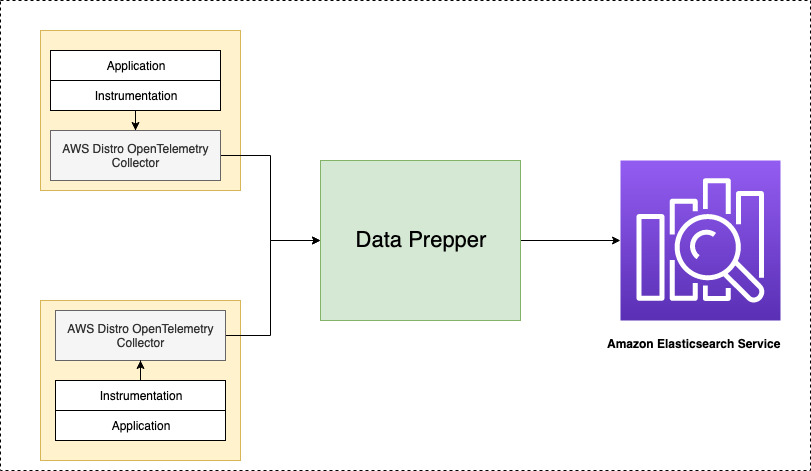

# Trace Analytics

## Introduction

Data Prepper is a key component in providing [Trace Analytics](https://opendistro.github.io/for-elasticsearch-docs/docs/trace/) feature in OpenDistro For Elasticsearch and Amazon Elasticsearch service. Data Prepper is a last mile server-side component which collects telemetry data from [AWS Distro OpenTelemetry collector](https://aws-otel.github.io/docs/getting-started/collector) or [OpenTelemetry collector](https://github.com/open-telemetry/opentelemetry-collector) and transforms it for Elasticsearch.
The transformed trace data is the visualized using the  [Trace Analytics Kibana plugin](https://opendistro.github.io/for-elasticsearch-docs/docs/trace/ta-kibana/), which provides at-a-glance visibility into your application performance, along with the ability to drill down on individual traces. 

Here is how all the components work in trace analytics,
 
 

 
 

In your service environment you will have to run OpenTelemetry Collector. You can run it as a sidecar or daemonset for EKS, a sidecar for ECS, or an agent on EC2. You should configure the collector to export trace data to Data Prepper. You will then have to deploy Data Prepper as an intermediate component and configure it to send the enriched trace data to your Opendistro For Elasticsearch cluster or Amazon Elasticsearch Service domain. Then using Kibana you can visualize and detect problems in your distributed applications. 

## Trace Analytics Pipeline

To achieve trace analytics in Data Prepper we have three pipelines `otel-trace-pipeline`, `raw-trace-pipeline` and `service-map-pipeline`

### OpenTelemetry Trace Source

The [OpenTelemetry source](../../data-prepper-plugins/otel-trace-source/README.md) accepts trace data from the OpenTelemetry collector. The source depends on [OpenTelemetry Protocol](https://github.com/open-telemetry/opentelemetry-specification/tree/master/specification/protocol). The source officially support transport over gRPC. The source also supports industry-standard encryption (TLS/HTTPS). 

### Processors

We have two processors for the Trace Analytics feature,
* *otel_trace_raw_processor* -  This processor is responsible for converting the trace data in [OpenTelemetry specification](https://github.com/open-telemetry/opentelemetry-proto/tree/master/opentelemetry/proto/trace/v1) to Elasticsearch friendly (JSON) docs. These elasticsearch friendly docs have certain additional fields like duration which are not part of the original OpenTelemetry specification. These additional fields are to make the instant kibana dashboards user-friendly.
* *service_map_stateful* -  This processor performs the required preprocessing on the trace data and build metadata to display the service-map kibana dashboards.

### Elasticsearch sink

We have a generic sink that writes the data to Elasticsearch as the destination. The [elasticsearch sink](../../data-prepper-plugins/elasticsearch/README.md) has configuration options related to elasticsearch cluster like endpoint, SSL/Username, index name, index template, index state management, etc. 
For the trace analytics feature, the sink has specific configurations which enables the sink to use indices and index templates specific to this feature. Trace analytics specific Elasticsearch indices are,
                                                                                                                                                                 
* *otel-v1-apm-span* -  This index stores the output from [otel-trace-raw-processor](../../data-prepper-plugins/otel-trace-raw-processor/README.md). 
* *otel-v1-apm-service-map* - This index stores the output from the [service-map-processor](../../data-prepper-plugins/service-map-stateful/README.md).
