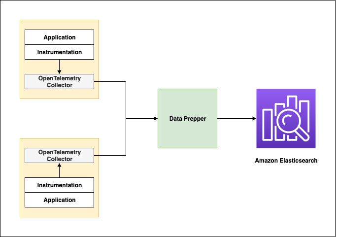

# Trace Analytics

## Introduction

Data Prepper ingests [Trace Analytics](https://opensearch.org/docs/monitoring-plugins/trace/index/) into OpenSearch
and Amazon OpenSearch Service. Data Prepper is a last mile server-side component which collects telemetry data
from [AWS Distro OpenTelemetry collector](https://aws-otel.github.io/docs/getting-started/collector) or
[OpenTelemetry collector](https://github.com/open-telemetry/opentelemetry-collector) and transforms it for OpenSearch.
The transformed trace data is the visualized using the
[Trace Analytics OpenSearch Dashboards plugin](https://opensearch.org/docs/monitoring-plugins/trace/ta-dashboards/),
which provides at-a-glance visibility into your application performance, along with the ability to drill down on individual traces.

Here is how all the components work in trace analytics,
<br />
<br />

<br />
<br />

In your service environment you will have to run OpenTelemetry Collector. You can run it as a sidecar or daemonset for EKS, a sidecar for ECS, or an agent on EC2. You should configure the collector to export trace data to Data Prepper. You will then have to deploy Data Prepper as an intermediate component and configure it to send the enriched trace data to your OpenSearch cluster or Amazon OpenSearch Service domain. Then using OpenSearch Dashboards you can visualize and detect problems in your distributed applications.

## Trace Analytics Pipeline

To achieve trace analytics in Data Prepper we have three pipelines `otel-trace-pipeline`, `raw-trace-pipeline` and `service-map-pipeline`


### OpenTelemetry Trace Source

The [OpenTelemetry source](../../data-prepper-plugins/otel-trace-source/README.md) accepts trace data from the OpenTelemetry collector. The source depends on [OpenTelemetry Protocol](https://github.com/open-telemetry/opentelemetry-specification/tree/master/specification/protocol). The source officially support transport over gRPC. The source also supports industry-standard encryption (TLS/HTTPS).

### Preppers

We have two preppers for the Trace Analytics feature,
* *otel_trace_raw_prepper* -  This prepper is responsible for converting the trace data in [OpenTelemetry specification](https://github.com/open-telemetry/opentelemetry-proto/tree/master/opentelemetry/proto/trace/v1) to OpenSearch-friendly (JSON) docs. These OpenSearch-friendly docs have certain additional fields like duration which are not part of the original OpenTelemetry specification. These additional fields are to make the instant OpenSearch Dashboards dashboards user-friendly.
* *service_map_stateful* -  This prepper performs the required preprocessing on the trace data and build metadata to display the service-map OpenSearch Dashboards dashboards.


### OpenSearch sink

We have a generic sink that writes the data to OpenSearch as the destination. The [opensearch sink](../../data-prepper-plugins/opensearch/README.md) has configuration options related to OpenSearch cluster like endpoint, SSL/Username, index name, index template, index state management, etc.
For the trace analytics feature, the sink has specific configurations which enables the sink to use indices and index templates specific to this feature. Trace analytics specific OpenSearch indices are,

* *otel-v1-apm-span* -  This index stores the output from [otel-trace-raw-prepper](../../data-prepper-plugins/otel-trace-raw-prepper/README.md).
* *otel-v1-apm-service-map* - This index stores the output from the [service-map-prepper](../../data-prepper-plugins/service-map-stateful/README.md).

### Pipeline Configuration

Create a file, `pipeline.yaml`. Paste the following data in there.

```
otel-trace-pipeline:
  # workers is the number of threads processing data in each pipeline. 
  # We recommend same value for all pipelines.
  # default value is 1, set a value based on the machine you are running Data Prepper
  workers: 8 
  # delay in milliseconds is how often the worker threads should process data.
  # Recommend not to change this config as we want the otel-trace-pipeline to process as quick as possible
  # default value is 3_000 ms
  delay: "100" 
  source:
    otel_trace_source:
      ssl: false # Change this to enable encryption in transit
  buffer:
    bounded_blocking:
       # buffer_size is the number of ExportTraceRequest from otel-collector the data prepper should hold in memeory. 
       # We recommend to keep the same buffer_size for all pipelines. 
       # Make sure you configure sufficient heap
       # default value is 512
       buffer_size: 512
       # This is the maximum number of request each worker thread will process within the delay.
       # Default is 8.
       # Make sure buffer_size >= workers * batch_size
       batch_size: 8
  sink:
    - pipeline:
        name: "raw-pipeline"
    - pipeline:
        name: "service-map-pipeline"
raw-pipeline:
  # Configure same as the otel-trace-pipeline
  workers: 8 
  # We recommend using the default value for the raw-pipeline.
  delay: "3000" 
  source:
    pipeline:
      name: "otel-trace-pipeline"
  buffer:
      bounded_blocking:
         # Configure the same value as in otel-trace-pipeline
         # Make sure you configure sufficient heap
         # default value is 512
         buffer_size: 512
         # The raw prepper does bulk request to your OpenSearch sink, so configure the batch_size higher.
         # If you use the recommended otel-collector setup each ExportTraceRequest could contain max 50 spans. https://github.com/opensearch-project/data-prepper/tree/v0.7.x/deployment/aws
         # With 64 as batch size each worker thread could process upto 3200 spans (64 * 50)
         batch_size: 64
  prepper:
    - otel_trace_raw_prepper:
  sink:
    - opensearch:
        hosts: [ "https://localhost:9200" ]
        trace_analytics_raw: true
        # Change to your credentials
        username: "admin"
        password: "admin"
        # Add a certificate file if you are accessing an OpenSearch cluster with a self-signed certificate  
        #cert: /path/to/cert
        # If you are connecting to an Amazon OpenSearch Service domain without
        # Fine-Grained Access Control, enable these settings. Comment out the
        # username and password above.
        #aws_sigv4: true
        #aws_region: us-east-1
service-map-pipeline:
  workers: 8
  delay: "100"
  source:
    pipeline:
      name: "otel-trace-pipeline"
  prepper:
    - service_map_stateful:
        # The window duration is the maximum length of time the data prepper stores the most recent trace data to evaluvate service-map relationships. 
        # The default is 3 minutes, this means we can detect relationships between services from spans reported in last 3 minutes.
        # Set higher value if your applications have higher latency. 
        window_duration: 180 
  buffer:
      bounded_blocking:
         # buffer_size is the number of ExportTraceRequest from otel-collector the data prepper should hold in memeory. 
         # We recommend to keep the same buffer_size for all pipelines. 
         # Make sure you configure sufficient heap
         # default value is 512
         buffer_size: 512
         # This is the maximum number of request each worker thread will process within the delay.
         # Default is 8.
         # Make sure buffer_size >= workers * batch_size
         batch_size: 8
  sink:
    - opensearch:
        hosts: [ "https://localhost:9200" ]
        trace_analytics_service_map: true
        # Change to your credentials
        username: "admin"
        password: "admin"
        # Add a certificate file if you are accessing an OpenSearch cluster with a self-signed certificate  
        #cert: /path/to/cert
        # If you are connecting to an Amazon OpenSearch Service domain without
        # Fine-Grained Access Control, enable these settings. Comment out the
        # username and password above.
        #aws_sigv4: true
        #aws_region: us-east-1
```

You will need to modify the configuration above for your OpenSearch cluster. Note that it has two
`opensearch` sinks which need to be modified.

The main changes you will need to make are:
* `hosts` - Set to your hosts
* `username` - Provide the OpenSearch username
* `password` - Provide your OpenSearch password
* `aws_sigv4` - If you are Amazon OpenSearch Service with AWS signing, set this to `true`. It will sign requests with the default AWS credentials provider.
* `aws_region` - If you are Amazon OpenSearch Service with AWS signing, set this value to your region.

The the [Data Prepper OpenSearch Sink](../../data-prepper-plugins/opensearch/README.md#Configuration) documents
other configurations available for OpenSearch.

### Data Prepper Configuration

Create a file, `data-prepper-config.yaml`. Paste the following data in there.

```
ssl: false
```

See the [API documentation](core_apis.md) if you wish to configure your Data Prepper server with TLS/SSL.

## OpenTelemetry Collector

You will have to run OpenTelemetry collector in your service environment. You can find the installation guide of OpenTelemetry collector [here](https://opentelemetry.io/docs/collector/getting-started/#getting-started).  Please ensure you that you configure the collector with an exporter configured to your Data Prepper. Below is an example otel-collector-config.yaml that receives data from various instrumentations and export it to Data Prepper.

```
receivers:
  jaeger:
    protocols:
      grpc:
  otlp:
    protocols:
      grpc:
  zipkin:

processors:
  batch/traces:
    timeout: 1s
    send_batch_size: 50

exporters:
  otlp/data-prepper:
    endpoint: localhost:21890
    insecure: true

service:
  pipelines:
    traces:
      receivers: [jaeger, otlp, zipkin]
      exporters: [otlp/data-prepper]
```

Configure your application to use the OpenTelemetry Collector.

You will normally run the OpenTelemetry Collector alongside your application.

## Next Steps and More Information

The [OpenSearch Trace Analytics](https://opensearch.org/docs/monitoring-plugins/trace/index/) documentation
provides additional details on configuring OpenSearch for viewing trace analytics. In particular, it
documents how to use OpenSearch Dashboards.

The [Trace Tuning page](trace_tuning.md) has information to help you tune and scale Data Prepper for
trace analytics use cases.
