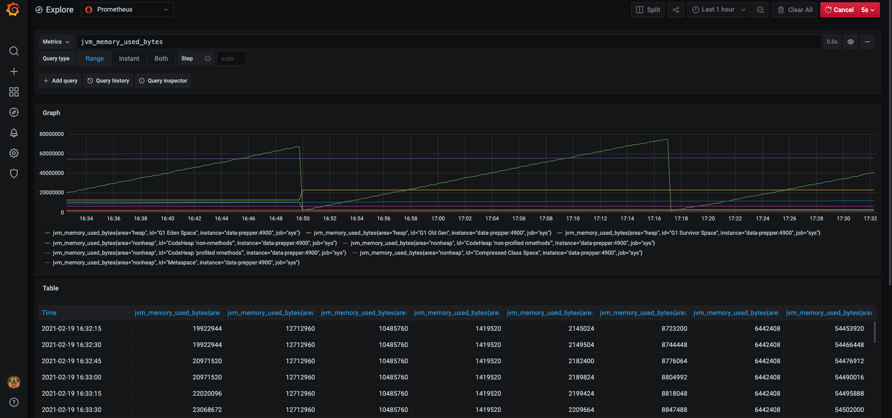

# Dev Trace Analytics Sample App
This directory contains the same sample app under the /examples directory, except with the following changes:
1. Data Prepper is built using the code in this repository, instead of a pulled image from DockerHub
2. A container for dnsmasq is included for network tests
3. Prometheus and Grafana containers for metrics visualization
   1. Prometheus can be accessed at http://localhost:9090/
   2. Grafana can be accessed at http://localhost:3000/. [Add a Prometheus data source](https://prometheus.io/docs/visualization/grafana/) 
   with one of the following HTTP config:
        - URL: `prometheus:9090`; Access: `Server (default)`
        - URL: `http://localhost:9090`; Access: `Browser`
   Then checkout the metrics graph in `Explore` of the sidebar such as the following: 

        

 

Start the project with with `docker-compose up -d --build` (--build is optional)

 