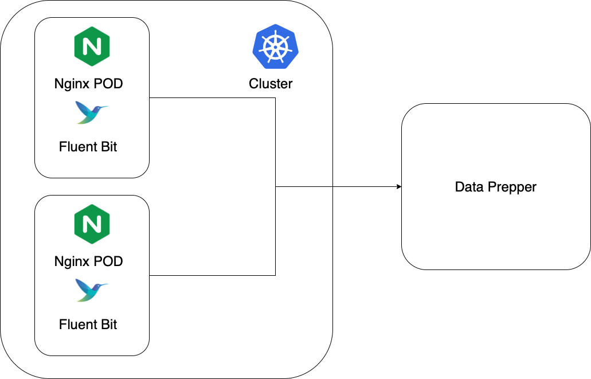

# Kubernetes Logging with Fluent Bit and Data Prepper

[Fluent Bit](http://fluentbit.io/) is a lightweight and extensible __Log and Metrics Processor__ that comes with full support for Kubernetes:

* Read Kubernetes/Docker log files from the file system or through systemd Journal
* Enrich logs with Kubernetes metadata
* Deliver logs to third party services.

This example uses [minikube](https://minikube.sigs.k8s.io/docs/) to demo Fluent Bit to Data Prepper pipeline that collects and ingest logs from `my-app` [namespace](https://kubernetes.io/docs/concepts/overview/working-with-objects/namespaces/). 
The service architecture is illustrated as follows:

We deploy two `nginx` [pods](https://kubernetes.io/docs/concepts/workloads/pods/) and expose a `my-nginx` [service](https://kubernetes.io/docs/concepts/services-networking/service/) on top of them in the `my-app` namespace. Then in the `logging` namespace,
we deploy Fluent Bit as [DaemonSet](https://kubernetes.io/docs/concepts/workloads/controllers/daemonset/) that runs in every node in Kubernetes collects and forwards logs to an pre-existing Data Prepper endpoint, which is located outside 
Kubernetes cluster.

## Getting started

### Prerequisite
A Data Prepper endpoint with [example_log_pipeline.yaml](data-prepper-pipeline-config/example_log_pipeline.yaml) configured. For example, you could run Data Prepper via Docker:

For Data Prepper 2.0 or above:
```
docker run -p 2021:2021 -p 4900:4900 --name data-prepper -v ${PWD}/data-prepper-pipeline-config/example_log_pipeline.yaml:/usr/share/data-prepper/pipelines/example_log_pipeline.yaml opensearchproject/data-prepper:latest
```

For Data Prepper before version 2.0:
```
docker run -p 2021:2021 -p 4900:4900 --name data-prepper -v ${PWD}/data-prepper-pipeline-config/example_log_pipeline.yaml:/usr/share/data-prepper/pipelines.yaml opensearchproject/data-prepper:latest
```

### Steps
1. Install [Docker](https://docs.docker.com/get-docker/).
2. Setup kubectl and minikube locally
    1. https://kubernetes.io/docs/tasks/tools/install-kubectl/
    2. https://minikube.sigs.k8s.io/docs/start/
Notice that this demo works with minikube version from 1.22.0 to 1.24.0.
3. Replace the `Host` value in `output-data-prepper.conf` in [fluent-bit-05-configmap.yaml](fluent-bit-05-configmap.yaml) with your Data Prepper endpoint. For example,
if the Data Prepper is running locally, set `Host` value to be `host.docker.internal` (hostname to access docker host on MacOS/Windows) or 172.17.0.1 (docker host ip on Linux).
4. `minikube start`
5. You could run `kubectl apply -f .` to deploy everything or run step-by-step as follows:
   1. Deploy two `nginx` pods as sample application in `my-app` namespace and expose them as `my-nginx` service:
   ```
   $ kubectl apply -f my-app-01-ns.yaml
   $ kubectl create -f my-app-02-service.yaml
   $ kubectl create -f my-app-03-deployment.yaml
   ```
   2. Deploy Fluent Bit as DaemonSet in `logging` namespace:
   ```
   $ kubectl apply -f fluent-bit-01-ns.yaml
   $ kubectl create -f fluent-bit-02-service-account.yaml
   $ kubectl create -f fluent-bit-03-role-1.22.yaml
   $ kubectl create -f fluent-bit-04-role-binding-1.22.yaml
   $ kubectl create -f fluent-bit-05-configmap.yaml
   $ kubectl create -f fluent-bit-06-ds-minikube.yaml
   ```
6. Tunneling `my-nginx` service through minikube:
   ```
   $ minikube service my-nginx -n my-app
   ```
   The example output will be as follows:
   ```
   😿  service default/my-nginx has no node port
   🏃  Starting tunnel for service my-nginx.
   |-----------|----------|-------------|------------------------|
   | NAMESPACE |   NAME   | TARGET PORT |          URL           |
   |-----------|----------|-------------|------------------------|
   | default   | my-nginx |             | http://127.0.0.1:62907 |
   |-----------|----------|-------------|------------------------|
   ```
   which exposes a random port 62907 in the above example.
7. You could now curl the above exposed URL by
   ```
   curl http://127.0.0.1:62907
   ```
   and see response as follows:
   ```
   <!DOCTYPE html>
   <html>
   <head>
   <title>Welcome to nginx!</title>
   <style>
   html { color-scheme: light dark; }
   body { width: 35em; margin: 0 auto;
   font-family: Tahoma, Verdana, Arial, sans-serif; }
   </style>
   </head>
   <body>
   <h1>Welcome to nginx!</h1>
   <p>If you see this page, the nginx web server is successfully installed and
   working. Further configuration is required.</p>
   
   <p>For online documentation and support please refer to
   <a href="http://nginx.org/">nginx.org</a>.<br/>
   Commercial support is available at
   <a href="http://nginx.com/">nginx.com</a>.</p>
   
   <p><em>Thank you for using nginx.</em></p>
   </body>
   </html>
   ```
The deployed `nginx` pods will generate Apache logs accordingly and Fluent Bit DaemonSet will collect, parse, filter and output logs to Data Prepper backend. 
8. By configuring `stdout` as sink, the Data Prepper instance logs should now print out sample records as follows:
```
{"date":1.639425394678687E9,"log":"172.17.0.1 - - [13/Dec/2021:19:56:34 +0000] \"GET / HTTP/1.1\" 200 615 \"-\" \"curl/7.64.1\" \"-\"\n","stream":"stdout","time":"2021-12-13T19:56:34.6786871Z","kubernetes":{"pod_name":"my-nginx-5b56ccd65f-zfvtj","namespace_name":"my-app","pod_id":"2989f623-5a65-4caf-b33a-95154a04f53b","labels":{"pod-template-hash":"5b56ccd65f","run":"my-nginx"},"host":"minikube","container_name":"my-nginx","docker_id":"f827ae8f8ff66175da32776b3875fe10916378e89645288d415edfd22f060fdb","container_hash":"nginx@sha256:9522864dd661dcadfd9958f9e0de192a1fdda2c162a35668ab6ac42b465f0603","container_image":"nginx:latest"},"request":"/","auth":"-","ident":"-","response":"200","bytes":"615","clientip":"172.17.0.1","verb":"GET","httpversion":"1.1","timestamp":"13/Dec/2021:19:56:34 +0000"}
```

9. For debugging, one can also pull the logs of the Fluent Bit pods to check connection to Data Prepper endpoint and HTTP response status, e.g.
```
$ kubectl get pods -n logging
NAME               READY   STATUS    RESTARTS   AGE
fluent-bit-269s6   1/1     Running   0          88m

$ kubectl logs fluent-bit-269s6 -n logging
Fluent Bit v1.5.7
* Copyright (C) 2019-2020 The Fluent Bit Authors
* Copyright (C) 2015-2018 Treasure Data
* Fluent Bit is a CNCF sub-project under the umbrella of Fluentd
* https://fluentbit.io

[2022/01/21 16:28:10] [ info] [engine] started (pid=1)
[2022/01/21 16:28:10] [ info] [storage] version=1.0.5, initializing...
[2022/01/21 16:28:10] [ info] [storage] in-memory
[2022/01/21 16:28:10] [ info] [storage] normal synchronization mode, checksum disabled, max_chunks_up=128
[2022/01/21 16:28:10] [ info] [filter:kubernetes:kubernetes.0] https=1 host=kubernetes.default.svc port=443
[2022/01/21 16:28:10] [ info] [filter:kubernetes:kubernetes.0] local POD info OK
[2022/01/21 16:28:10] [ info] [filter:kubernetes:kubernetes.0] testing connectivity with API server...
[2022/01/21 16:28:10] [ info] [filter:kubernetes:kubernetes.0] API server connectivity OK
[2022/01/21 16:28:10] [ info] [http_server] listen iface=0.0.0.0 tcp_port=2020
[2022/01/21 16:28:10] [ info] [sp] stream processor started
[2022/01/21 16:28:20] [ info] inotify_fs_add(): inode=3417785 watch_fd=1 name=/var/log/containers/my-nginx-5b56ccd65f-klwf5_my-app_my-nginx-492a38838b083a34da0e2cd0b81380cc6451bac3070be3922162d17a11973e2e.log
[2022/01/21 16:28:20] [ info] inotify_fs_add(): inode=3417837 watch_fd=2 name=/var/log/containers/my-nginx-5b56ccd65f-qtsdn_my-app_my-nginx-aa4c5873e3a3d46906cd2624b919e4dc2f4bfda0d7f07836cf8e43e954466108.log
[2022/01/21 16:28:21] [error] [io] connection #40 failed to: host.docker.internal:2021
[2022/01/21 16:28:21] [error] [output:http:http.0] no upstream connections available to host.docker.internal:2021
[2022/01/21 16:28:21] [error] [io] connection #40 failed to: host.docker.internal:2021
[2022/01/21 16:28:21] [error] [output:http:http.0] no upstream connections available to host.docker.internal:2021
[2022/01/21 16:28:21] [ warn] [engine] failed to flush chunk '1-1642782500.64559100.flb', retry in 11 seconds: task_id=0, input=tail.0 > output=http.0
[2022/01/21 16:28:21] [ warn] [engine] failed to flush chunk '1-1642782500.125062900.flb', retry in 9 seconds: task_id=1, input=tail.0 > output=http.0
[2022/01/21 16:28:30] [error] [io] connection #42 failed to: host.docker.internal:2021
[2022/01/21 16:28:30] [error] [output:http:http.0] no upstream connections available to host.docker.internal:2021
[2022/01/21 16:28:30] [ warn] [engine] chunk '1-1642782500.125062900.flb' cannot be retried: task_id=1, input=tail.0 > output=http.0
[2022/01/21 16:28:32] [error] [io] connection #40 failed to: host.docker.internal:2021
[2022/01/21 16:28:32] [error] [output:http:http.0] no upstream connections available to host.docker.internal:2021
[2022/01/21 16:28:32] [ warn] [engine] chunk '1-1642782500.64559100.flb' cannot be retried: task_id=0, input=tail.0 > output=http.0
[2022/01/21 16:28:37] [error] [io] connection #40 failed to: host.docker.internal:2021
[2022/01/21 16:28:37] [error] [output:http:http.0] no upstream connections available to host.docker.internal:2021
[2022/01/21 16:28:37] [ warn] [engine] failed to flush chunk '1-1642782516.428211600.flb', retry in 7 seconds: task_id=0, input=tail.0 > output=http.0
[2022/01/21 16:28:43] [error] [io] connection #41 failed to: host.docker.internal:2021
[2022/01/21 16:28:43] [error] [output:http:http.0] no upstream connections available to host.docker.internal:2021
[2022/01/21 16:28:43] [ warn] [engine] chunk '1-1642782516.428211600.flb' cannot be retried: task_id=0, input=tail.0 > output=http.0
[2022/01/21 16:35:02] [ info] [output:http:http.0] host.docker.internal:2021, HTTP status=200
200 OK
```

10. To clean up the resources created in minikube
   ```
   kubectl delete -f .
   ```
11. Stop minikube
    ```
    minikube stop
    ```
   
## Reference

* https://github.com/fluent/fluent-bit-kubernetes-logging
