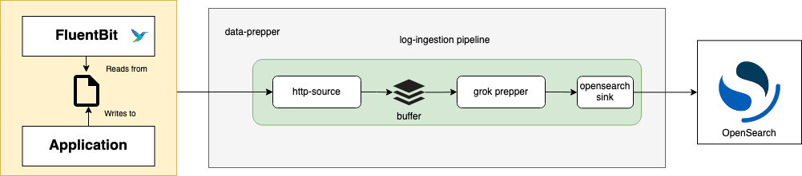

# Data Prepper Log Ingestion Demo Guide

This is a guide that will walk users through setting up a sample Data Prepper pipeline for log ingestion.
This guide will go through the steps required to create a simple log ingestion pipeline from \
Fluent Bit → Data Prepper → OpenSearch. This log ingestion flow is shown in the diagram below.



## List of Components

- An OpenSearch domain running through Docker.
- A Fluent Bit agent running through Docker using `fluent-bit.conf`.
- Data Prepper, which includes a `log_pipeline.yaml` and `data-prepper-config.yaml`for data-prepper server configuration running through Docker.
- An Apache Log Generator in the form of a python script.

## Overview

The example is split across two Docker Compose files:

- [docker-compose.yaml](docker-compose.yaml) defines the Fluent Bit, OpenSearch, and OpenSearch Dashboards containers.
- [docker-compose-dataprepper.yaml](docker-compose-dataprepper.yaml) defines the Data Prepper container, which uses [log_pipeline.yaml](log_pipeline.yaml) and [data-prepper-config.yaml](data-prepper-config.yaml).

Fluent Bit is configured in [fluent-bit.conf](fluent-bit.conf) to tail `/var/log/test.log` and forward each new line to Data Prepper's HTTP source on port 2021. The [log_pipeline.yaml](log_pipeline.yaml) file configures Data Prepper to parse each log line with the `COMMONAPACHELOG` grok pattern and write it to the `apache_logs` index in OpenSearch.

The empty `test.log` file is mounted into the Fluent Bit container through `docker-compose.yaml`.

## Running the example

Start all four containers in a single command so that they join the same Docker network:

```
docker compose -f docker-compose.yaml -f docker-compose-dataprepper.yaml up
```

The containers must start as one project. If you run the two Compose files separately, they create two different Docker networks (`log-ingestion_opensearch-net` and `data-prepper_opensearch-net`) and the containers in each project cannot reach each other, so Fluent Bit cannot deliver logs to Data Prepper and Data Prepper cannot deliver logs to OpenSearch.

Wait until the Data Prepper logs include:

```
INFO org.opensearch.dataprepper.plugins.sink.opensearch.OpenSearchSink - Initialized OpenSearch sink
INFO org.opensearch.dataprepper.core.pipeline.Pipeline - Pipeline [log-pipeline] Sink is ready, starting source...
INFO org.opensearch.dataprepper.plugins.source.loghttp.HTTPSource - Started http source on port 2021...
```

Data Prepper only starts its HTTP source after it connects to OpenSearch, which can take a minute or longer. Logs written to `test.log` before the HTTP source starts can be dropped by Fluent Bit after its retries fail.

Verify OpenSearch Dashboards is reachable at http://127.0.0.1:5601/ (log in as `admin` with the password set in `docker-compose.yaml`, `Developer@123` by default).

## Apache Log Generator

Note that if you just want to see the log ingestion workflow in action, you can simply copy and paste some logs into the `test.log` file yourself without using the Python [Fake Apache Log Generator](https://github.com/graytaylor0/Fake-Apache-Log-Generator).
Here is a sample batch of randomly generated Apache Logs if you choose to take this route.

```
63.173.168.120 - - [04/Nov/2021:15:07:25 -0500] "GET /search/tag/list HTTP/1.0" 200 5003
71.52.186.114 - - [04/Nov/2021:15:07:27 -0500] "GET /search/tag/list HTTP/1.0" 200 5015
223.195.133.151 - - [04/Nov/2021:15:07:29 -0500] "GET /posts/posts/explore HTTP/1.0" 200 5049
249.189.38.1 - - [04/Nov/2021:15:07:31 -0500] "GET /app/main/posts HTTP/1.0" 200 5005
36.155.45.2 - - [04/Nov/2021:15:07:33 -0500] "GET /search/tag/list HTTP/1.0" 200 5001
4.54.90.166 - - [04/Nov/2021:15:07:35 -0500] "DELETE /wp-content HTTP/1.0" 200 4965
214.246.93.195 - - [04/Nov/2021:15:07:37 -0500] "GET /apps/cart.jsp?appID=4401 HTTP/1.0" 200 5008
72.108.181.108 - - [04/Nov/2021:15:07:39 -0500] "GET /wp-content HTTP/1.0" 200 5020
194.43.128.202 - - [04/Nov/2021:15:07:41 -0500] "GET /app/main/posts HTTP/1.0" 404 4943
14.169.135.206 - - [04/Nov/2021:15:07:43 -0500] "DELETE /wp-content HTTP/1.0" 200 4985
208.0.179.237 - - [04/Nov/2021:15:07:45 -0500] "GET /explore HTTP/1.0" 200 4953
134.29.61.53 - - [04/Nov/2021:15:07:47 -0500] "GET /explore HTTP/1.0" 200 4937
213.229.161.38 - - [04/Nov/2021:15:07:49 -0500] "PUT /posts/posts/explore HTTP/1.0" 200 5092
82.41.77.121 - - [04/Nov/2021:15:07:51 -0500] "GET /app/main/posts HTTP/1.0" 200 5016
```

Additionally, if you just want to test a single log, you can send it to `test.log` directly with:

```
echo '63.173.168.120 - - [04/Nov/2021:15:07:25 -0500] "GET /search/tag/list HTTP/1.0" 200 5003' >> test.log
```

In order to simulate an application generating logs, a simple python script will be used. This script only runs with python 2. You can download this script by running.

```
git clone https://github.com/graytaylor0/Fake-Apache-Log-Generator.git
```

Note the requirements in the README of the Apache Log Generator. You must have Python 2.7 and you must run
```
pip install -r requirements.txt
```

to install the necessary dependencies.

Run the apache log generator python script so that it sends an apache log to the `test.log` file from the fluent-bit `docker-compose.yaml` every 2 seconds.

```
python apache-fake-log-gen.py -n 0 -s 2 -l "CLF" -o "LOG" -f "/full/path/to/test.log"
```

You should now be able to check your terminal output for Fluent Bit and Data Prepper to verify that they are processing logs.

The following Fluent Bit output means that Fluent Bit was able to forward logs to the Data Prepper http source.

```
fluent-bit  | [ info] [output:http:http.0] data-prepper:2021, HTTP status=200
200 OK
```

Data Prepper sends documents to OpenSearch in batches, so the first document can take a minute or longer to appear in the `apache_logs` index after Fluent Bit delivers it. To check whether a document has been indexed, run:

```
curl -X GET -u 'admin:Developer@123' -k 'https://localhost:9200/apache_logs/_search?pretty&size=1'
```

Finally, head into OpenSearch Dashboards ([http://localhost:5601](http://localhost:5601)) (login with credentials) to view your processed logs.
You will need to create an index pattern for the index provided in your `pipeline.yaml` (i.e. `apache_logs`) in order to see them. You can do this by selecting the `Manage` menu with the gear icon at the top of the home page and then the `Index Patterns` menu on the left side of the page. Select the `Create index pattern` button and then start typing in the name of the index you sent logs to in the `Index pattern name` field (in this guide it was `apache_logs`). You should see that the index pattern matches 1 source (This will only be seen if data-prepper is working well with the opensource).

The `apache_logs` index does not contain a field of the `date` type, so leave the time field unset when you create the index pattern.

Click `Next Step` and then `Create index pattern`. After, you should be able to go to the `Discover` page with a link on the menu to the left, and see your processed logs.
