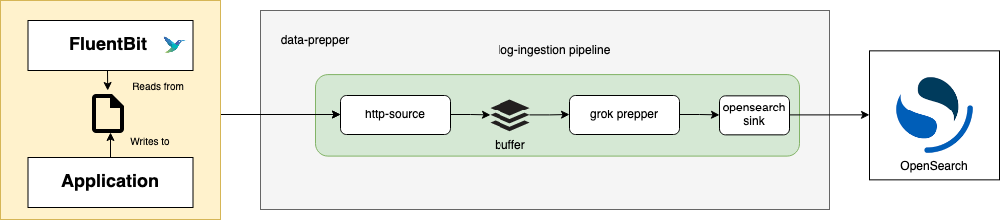

# Data Prepper Log Ingestion Demo Guide

This is a guide that will walk users through setting up a sample Data Prepper for log ingestion. 
This guide will go through the steps required to create a simple log ingestion pipeline from \
Fluent Bit → Data Prepper → OpenSearch. This log ingestion flow is shown in the diagram below.



## List of Components

- An OpenSearch domain running locally. The steps to get started with OpenSearch can be found [here](https://opensearch.org/downloads.html).
- Data Prepper, which includes a `pipeline.yaml` and a `data-prepper-config.yaml` 
- A FluentBit agent running through Docker
- An Apache Log Generator in the form of a python script

### Data Prepper Setup

1. Pull down the Data Prepper repository

```
git clone https://github.com/opensearch-project/data-prepper.git
```

2. Build the Data Prepper jar. You must have JDK 14 or 15 in order to build successfully. For more info on building from source, see the 
[Data Prepper Developer Guide](../../docs/developer_guide.md)
   
```
./gradlew build`
```
   
3. Create the following pipeline.yaml. This configuration will take logs sent to the [http source](../../data-prepper-plugins/http-source), 
process them with the [Grok Prepper](../../data-prepper-plugins/grok-prepper) by matching against the `COMMONAPACHELOG` pattern, 
and send the processed logs to a local [OpenSearch sink](../../data-prepper-plugins/opensearch) to an index named `grok-prepper`. 

```yaml
grok-pipeline:
  source:
    http:
  prepper:
    - grok:
        match:
          log: [ "%{COMMONAPACHELOG}" ]
  sink:
    - opensearch:
        hosts: [ "https://localhost:9200" ]
        username: admin
        password: admin
        index: grok-prepper
```
   
4. Create the following `data-prepper-config.yaml`

```yaml
ssl: false
```

5. From the root of the data prepper repo, 
   run the Data Prepper jar with the `pipeline.yaml` and `data-prepper-config.yaml` as command line arguments.
   
```
java -jar data-prepper-core/build/libs/data-prepper-core-1.2.0-SNAPSHOT.jar /full/path/to/pipeline.yaml /full/path/to/data-prepper-config.yaml
```

If you see an error that looks like this: `Caused by: java.lang.RuntimeException: Connection refused`, then that probably means you don't have OpenSearch running locally. 
Go [here](https://opensearch.org/downloads.html) to do so before moving on to the next step of this guide.

If Data Prepper is running correctly, you should see something similar to the following line as the latest output in your terminal.

```
INFO  com.amazon.dataprepper.pipeline.ProcessWorker - grok-pipeline Worker: No records received from buffer
```

### FluentBit Setup

The FluentBit setup includes a `docker-compose.yaml`, a `fluent-bit.conf`, and a log file which corresponds to where FluentBit will look for logs.

1. Create the following `docker-compose.yaml`. This `docker-compose.yaml` will pull the FluentBit Docker image, and will mount your `fluent-bit.conf` and log file to this Docker image. In this case, the log file is named `test.log`.

```yaml
version: "3.7"

services:
  fluent-bit:
    image: fluent/fluent-bit
    volumes:
      - ./fluent-bit.conf:/fluent-bit/etc/fluent-bit.conf
      - ./test.log:/var/log/test.log
```

2. Create the following `fluent-bit.conf`. This config will tell FluentBit to tail the `/var/log/test.log` file for logs, and uses the FluentBit http output plugin to forward these logs to the http source of Data Prepper, which runs by default on port 2021.

```
[INPUT]
  name                  tail
  refresh_interval      5
  path                  /var/log/test.log
  read_from_head        true

[OUTPUT]
  Name http
  Match *
  Host host.docker.internal
  Port 2021
  URI /log/ingest
  Format json
```

3. Create an empty file named `test.log`. This file can be named whatever you like, but the `docker-compose.yaml` will need to be updated accordingly.


4. Now that you have the `docker-compose.yaml`, `fluent-bit.conf`, and the `test.log` files, FluentBit is ready for log ingestion. Start FluentBit with

```
docker-compose up
```

### Apache Log Generator

In order to simulate an application generating logs, a simple python script will be used. This script only runs with python 2. You can download this script by running

```
git clone https://github.com/graytaylor0/Fake-Apache-Log-Generator.git
```

Note the requirements in the README of the Apache Log Generator. You must have Python 2.7 and you must run 
```
pip install -r requirements.txt
```

to install the necessary dependencies.

Run the apache log generator python script so that it sends an apache log to the `test.log` file from the fluent-bit `docker-compose.yaml` every 2 seconds. 

```
python apache-fake-log-gen.py -n 0 -s 2 -l "CLF" -o "LOG" -f "/full/path/to/test.log"
```

You should now be able to check your terminal output for FluentBit and Data Prepper to verify that they are processing logs.

The following FluentBit ouptut means that FluentBit was able to forward logs to the Data Prepper http source

```
fluent-bit_1  | [2021/10/30 17:16:39] [ info] [output:http:http.0] host.docker.internal:2021, HTTP status=200
```

The following Data Prepper output indicates that Data Prepper is successfully processing logs from FluentBit

```
2021-10-30T12:17:17,474 [grok-pipeline-prepper-worker-1-thread-1] INFO  com.amazon.dataprepper.pipeline.ProcessWorker -  grok-pipeline Worker: Processing 2 records from buffer
```

Finally, head into OpenSearch Dashboards ([http://localhost:5601](http://localhost:5601)) to view your processed logs.
You will need to create an index pattern for the index provided in your `pipeline.yaml` in order to see them. You can do this by going to
`Stack Management -> Index Pattterns`. Now start typing in the name of the index you sent logs to (in this guide it was `grok-prepper`),
and you should see that the index pattern matches 1 source. Click `Create Index Pattern`, and you should then be able to go back to 
the `Discover` tab to see your processed logs. 
