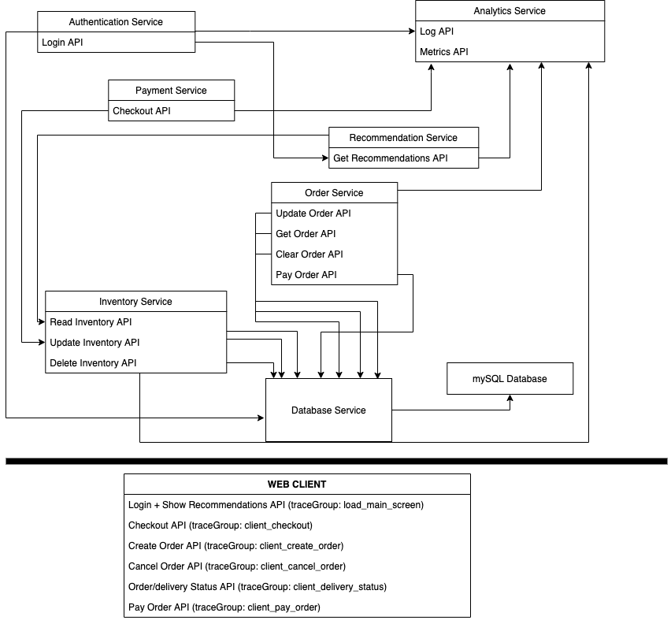

# Trace Analytics Sample App

This is a demo that is built to demonstrate the Trace Analytics feature that is supported by OpenSearch. For the demo we have mock e-commerce app which consists of a group of microservices. This demo uses OpenTelemetry libraries to produce trace data and uses Data Prepper to ingest data into OpenSearch. 
 
## Run

### Required

* Docker - we recommend allowing Docker to use at least 4 GB of RAM in Preferences > Resources.

### Demo

```
docker-compose up -d
```

* Wait for 5 mins, this is because we spin up multiple python services, OpenSearch and OpenSearch Dashboards. The DataPrepper will restart till OpenSearch becomes available.

* Navigate to localhost:8089


## Architecture

Below is the architecture of the mock ecommerce app.



There is one client file:
- client.py

The following are the backend services running on different ports:
- inventoryService.py -> 8082
- databaseService.py -> 8083
- paymentService.py -> 8084
- authenticationService.py -> 8085
- recommendationService.py -> 8086
- orderService.py -> 8088
- analytics-service -> 8087
- otel-collector -> 55680 
- transformation-instance -> 9400.

The following are the database/storage we run on different ports.
- mysql -> 3306
- opensearch -> 9200,9300

The client makes API calls that produces the APM data that falls into the following trace groups:

- load_main_screen
- client_checkout
- client_create_order
- client_cancel_order
- client_delivery_status
- client_pay_order

Correspondingly, on the server side, the API calls are as follows

- /server_request_login (autheticationService:8085) -> /recommend (recommendationService:8086) -> /read_inventory (inventoryService:8082) -> /get_inventory (databaseService:8083) -> mysql
- /checkout (paymentService:8084) -> /update_inventory (inventoryService:8082) -> /update_item (databaseService:8083) -> mysql
- /update_order (orderService:8088) -> /add_item_to_cart or /remove_item_from_cart (databaseService:8083) -> mysql
- /clear_order (orderService:8088) -> /cart_empty (databaseService:8083) -> mysql
- /get_order (orderService:8088) -> /get_cart (databaseService:8083) -> mysql
- /pay_order (orderService:8088) -> /cart_sold (databaseService:8083) -> mysql

Each API call in the chains above calls `/logs (analytics-service:8087)` in the analytics service.

## Run

To run this application together with client:
```
docker-compose up --build -d
```
